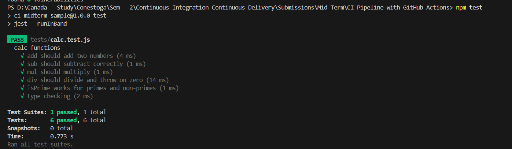
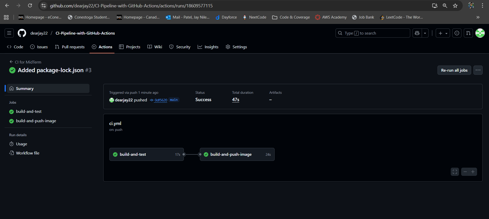
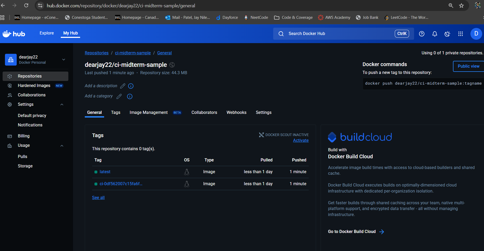
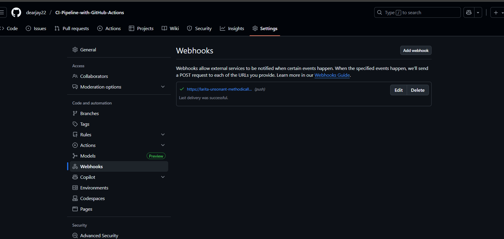
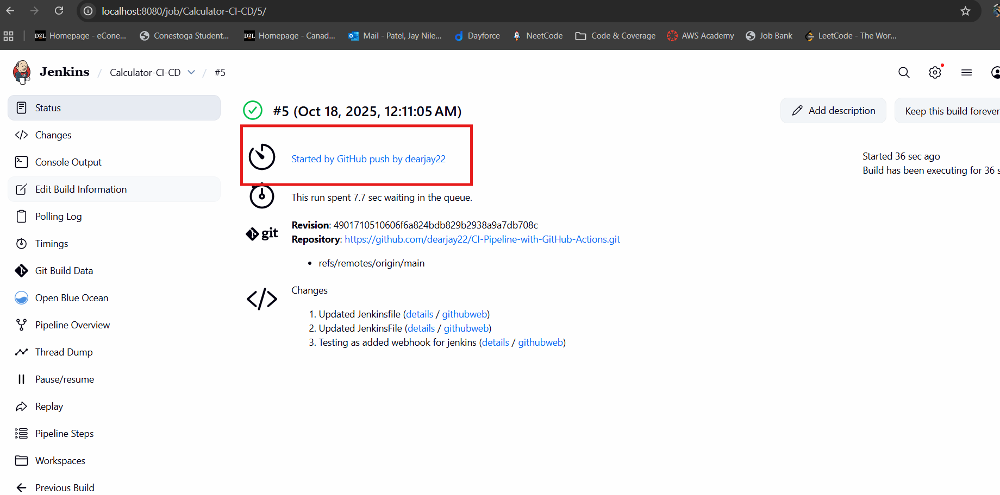
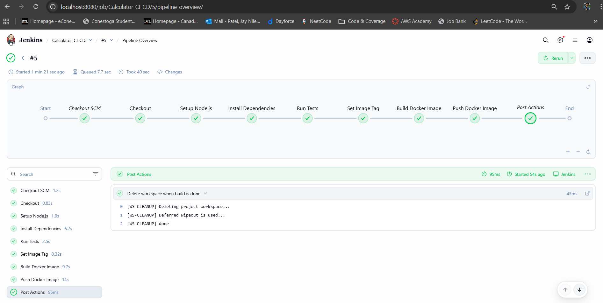

# CI Midterm Sample Project

Simple Node.js app used for demonstrating CI with GitHub Actions and Docker image publishing.

## How to run locally

1. Install deps:

```bash
npm install
```

2. Run tests:

```bash
npm test
```

2. Start server:

```bash
npm start
# server listens on http://localhost:3000
```
Example request:

```bash
curl -s -X POST http://localhost:3000/calc -H "Content-Type: application/json" -d '{"op":"add","a":5,"b":2}'
```

## How CI pipeline works

- The Actions workflow at .github/workflows/ci.yml runs on push and pull_request.

- Job build-and-test runs npm ci and npm test. If tests fail, the pipeline fails (required).

- After tests pass, build-and-push-image builds a Docker image and pushes it to Docker Hub (by default).


## Configure secrets (GitHub)

- Go to Settings > Secrets and variables > Actions and add:

- DOCKERHUB_USERNAME — your Docker Hub username

- DOCKERHUB_TOKEN — Docker Hub access token (or password, but token preferred)


## Docker image

If you used Docker Hub and the repo is yourusername/ci-midterm-sample, you can pull:
```bash
docker pull yourusername/ci-midterm-sample:latest
```

## Demonstrate success & failure scenarios

- Success: push to main -> tests pass -> image is pushed.

- Failure: to demonstrate a failing run, edit tests/calc.test.js to intentionally assert wrong value (or temporarily change one function to return wrong result), push, and confirm that Actions marks the run as failed. Revert the change afterward.

## Jenkins

- Create credentials with Docker Hub username/password (or token) and update DOCKERHUB_CREDENTIALS credential id in Jenkinsfile.

- Ensure the agent has Docker and Node installed (or use a Docker agent).












